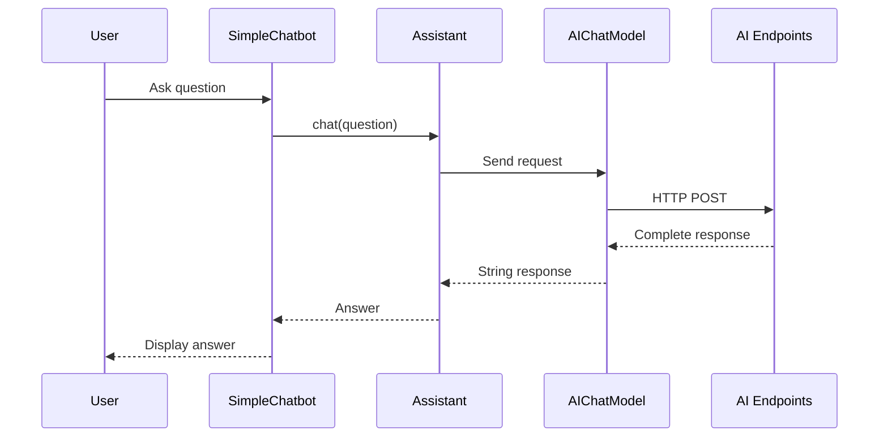
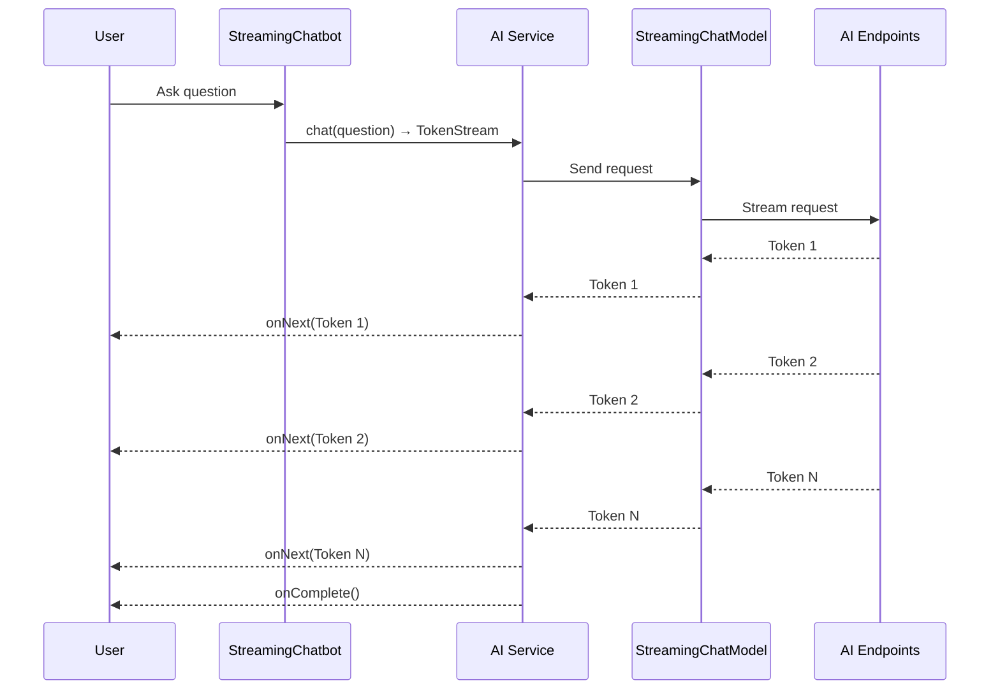
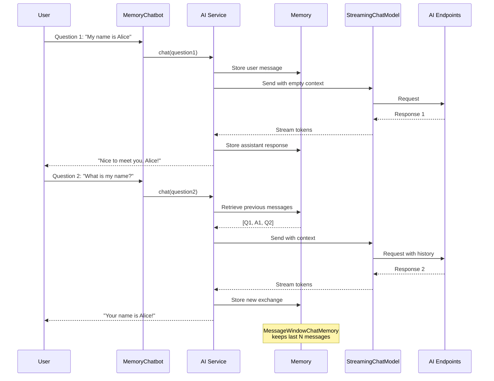
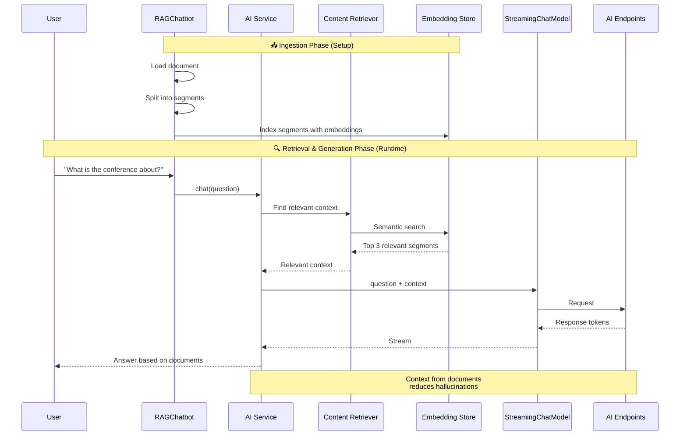
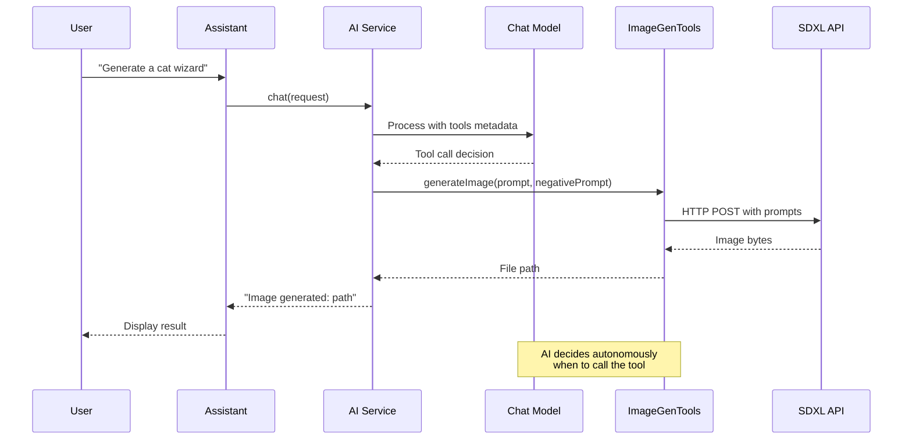
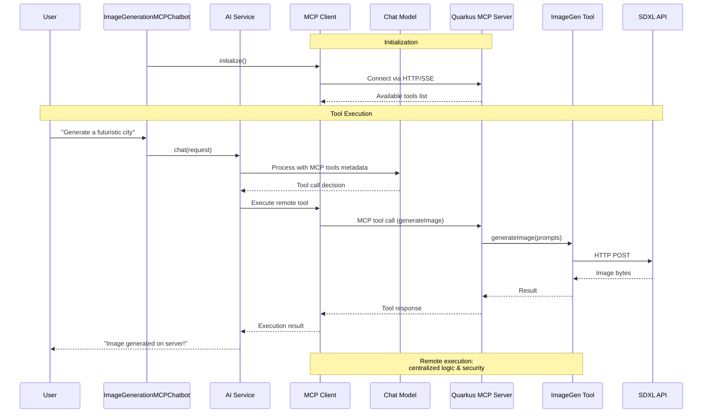

## ☕️ Java LangChain4j module for AI Endpoints workshop ☕️

**ℹ️ All solutions to this part are in the [solutions/chatbot/java/java-langchain4j](../../../../solutions/chatbot/java/java-langchain4j) folder. ℹ️**

### ⚠️ Prerequisites ⚠️

If you use [Coder CDE](https://coder.com/) to open this project, all prerequisites are managed for you.  
In the other case you need: 
 - Java 25
 - [JBang](https://www.jbang.dev/) - Java scripting tool

> Note: This module uses [LangChain4j](https://docs.langchain4j.dev/intro/) - the library that makes development with LLMs simpler!

### 🤖 Models to use 🤖
 - the script [set-env-variables.sh](../../../../bin/set-env-variables.sh) se the default model name in the `OVH_AI_ENDPOINTS_MODEL_NAME` environment variable
 - you can try another model from the [OVHcloud AI Endpoints catalog](https://www.ovhcloud.com/en/public-cloud/ai-endpoints/catalog/)

### 📚 What you'll learn 📚

In this workshop, you'll build complete chatbot applications using **LangChain4j** with **[OVHcloud AI Endpoints](https://www.ovhcloud.com/en/public-cloud/ai-endpoints/catalog/)**.  
The workshop is divided into progressive modules:

1. 🤖 **Simple Chatbot** - Basic synchronous chatbot
2. 🌊 **Streaming Chatbot** - Real-time streaming responses
3. 🧠 **Memory Chatbot** - Conversational memory across requests
4. 📚 **RAG Chatbot** - Retrieval Augmented Generation with document embeddings
5. 🎨 **Function Calling** - Create and use tools for image generation
6. 🔌 **MCP Client** - Consume the MCP server created with Quarkus

---

## 🚀 Getting Started 🚀

### 🔧 Step 0: Project Setup

All files are already created for you in [workshop/chatbot/java/java-langchain4j](./)!

The project uses **JBang** - a Java scripting tool that allows running Java code without complex project setup.

📖 **Learn more**: [JBang Documentation](https://www.jbang.dev/)

### ▶️ Running Your Code

All chatbots can be run using the helper script:

```bash
./run-jbang.sh <ClassName>
```

For example:
```bash
./run-jbang.sh SimpleChatbot
```

🎯 **Tip**: JBang automatically handles dependencies defined in the Java file headers!

### 💡 Using VS Code Snippets 💡

This workshop provides **VS Code code snippets** as progressive hints to help you if you get stuck.

**How to use them:**
1. 📂 Open the Java file you're working on in VS Code
2. 📍 Place your cursor where you want to insert the code
3. ⌨️ Type the snippet prefix (e.g., `java-02`)
4. ✅ Press `Tab` or select the snippet from the autocomplete dropdown
5. ✨ The code will be automatically inserted!

> 📌 **Note**: Snippets are provided as a **last resort** hint (Level 3).
> Try to solve each step using the documentation and key classes hints first!
> The learning experience is much better when you write the code yourself! 💪

---

## 🤖 Module 1: Simple Chatbot 🤖

**Goal**: Create a basic synchronous chatbot that answers questions using AI Endpoints.

### 🎯 Architecture Overview



### 📝 Step 1.1: Create the AI Service Interface

**File to edit**: [SimpleChatbot.java](SimpleChatbot.java)

Define an interface that represents your AI assistant.

💡 **Key Concepts**:
- The interface defines the contract for your chatbot
- `@SystemMessage`: Sets the AI's role and personality
- LangChain4j will automatically implement this interface

<details>
<summary>🔎 Hint 1 - Concept & Documentation</summary>

LangChain4j uses **AI Services** to abstract LLM interactions behind a simple Java interface. You define an interface with a method, and annotate it with `@SystemMessage` to set the AI's role and personality. 

📖 **Tutorials**:
- [LangChain4j AI Services](https://docs.langchain4j.dev/tutorials/ai-services)
- [System Messages](https://docs.langchain4j.dev/tutorials/ai-services#systemmessage)

📖 **Javadoc**:
- [AiServices](https://docs.langchain4j.dev/apidocs/dev/langchain4j/service/AiServices.html)
- [@SystemMessage](https://docs.langchain4j.dev/apidocs/dev/langchain4j/service/SystemMessage.html)

</details>

<details>
<summary>🧩 Hint 2 - Key Classes & Methods</summary>

- Define an `interface` named `Assistant` inside your class
- Add a method that takes a `String` and returns a `String`
- Annotate the method with `@SystemMessage` to give the AI a name and role (e.g., "You are Nestor, a virtual assistant...")

</details>

<details>
<summary>🎁 Hint 3 - VS Code Snippet</summary>

Type `java-02` in your editor and press `Tab` to insert the complete interface definition.

</details>

---

### 📝 Step 1.2: Create the Chat Model

**File to edit**: [SimpleChatbot.java](SimpleChatbot.java)

Configure the OpenAI-compatible chat model to connect to [OVHcloud AI Endpoints](https://www.ovhcloud.com/en/public-cloud/ai-endpoints/catalog/).

💡 **Configuration Tips**:
- Use `AIChatModel.builder()` for configuration
- The `baseUrl` should point to [OVHcloud AI Endpoints](https://www.ovhcloud.com/en/public-cloud/ai-endpoints/catalog/)
- Set `temperature` to 0.0 for deterministic responses
- Use `maxTokens` to limit response length (512 is good for testing)

<details>
<summary>🔎 Hint 1 - Concept & Documentation</summary>

A **ChatModel** is the component that communicates with the LLM API. Since [OVHcloud AI Endpoints](https://www.ovhcloud.com/en/public-cloud/ai-endpoints/catalog/) are OpenAI-compatible, you'll use the OpenAI provider. The model is configured with a builder pattern specifying the API key, base URL, model name, and generation parameters.

📖 **Tutorials**:
- [OpenAI Chat Model Configuration](https://docs.langchain4j.dev/integrations/language-models/open-ai#chat-models)
- [LangChain4j Chat Model Interface](https://docs.langchain4j.dev/tutorials/chat-and-language-models)

📖 **Javadoc**:
- [OpenAiChatModel](https://docs.langchain4j.dev/apidocs/dev/langchain4j/model/openai/OpenAiChatModel.html)

</details>

<details>
<summary>🧩 Hint 2 - Key Classes & Methods</summary>

- Use `OpenAiChatModel.builder()` to start building
- Chain these builder methods:
  - `.apiKey(...)` - use `System.getenv("OVH_AI_ENDPOINTS_ACCESS_TOKEN")`
  - `.modelName(...)` - use `System.getenv("OVH_AI_ENDPOINTS_MODEL_NAME")`
  - `.baseUrl(...)` - use `System.getenv("OVH_AI_ENDPOINTS_MODEL_URL")`
  - `.maxTokens(512)` - limit response length
  - `.temperature(0.0)` - for deterministic responses
  - `.logRequests(false)` and `.logResponses(false)`
- End with `.build()`

</details>

<details>
<summary>🎁 Hint 3 - VS Code Snippet</summary>

Type `java-03` in your editor and press `Tab` to insert the complete model configuration.

</details>

---

### 📝 Step 1.3: Build the AI Service

**File to edit**: [SimpleChatbot.java](SimpleChatbot.java)

Use LangChain4j's `AiServices` builder to create your chatbot.

💡 **Builder Pattern**:
- Specify the interface class (`.class`)
- Connect your chat model
- The builder creates a proxy that implements your interface

<details>
<summary>🔎 Hint 1 - Concept & Documentation</summary>

The `AiServices` builder is the glue that connects your interface to the chat model. It creates a proxy that automatically implements your interface methods by calling the LLM under the hood.

📖 **Tutorials**:
- [AI Services Builder](https://docs.langchain4j.dev/tutorials/ai-services)

📖 **Javadoc**:
- [AiServices.builder()](https://docs.langchain4j.dev/apidocs/dev/langchain4j/service/AiServices.html#builder(java.lang.Class))

</details>

<details>
<summary>🧩 Hint 2 - Key Classes & Methods</summary>

- Use `AiServices.builder(Assistant.class)` to start
- Chain `.chatModel(chatModel)` to connect your model
- End with `.build()` to get an `Assistant` instance

</details>

<details>
<summary>🎁 Hint 3 - VS Code Snippet</summary>

Type `java-04` in your editor and press `Tab` to insert the AI service builder code.

</details>

---

### 📝 Step 1.4: Send a Prompt

**File to edit**: [SimpleChatbot.java](SimpleChatbot.java)

Call your assistant to test the chatbot.

💡 **Usage**:
- Simply call the `chat()` method on your assistant instance
- The prompt is automatically wrapped in the correct format

<details>
<summary>🔎 Hint 1 - Concept & Documentation</summary>

Once your AI Service is built, calling the LLM is as simple as calling a method on your interface! The prompt is automatically wrapped in the correct format and sent to the model.

📖 **Tutorials**:
- [AI Services Usage](https://docs.langchain4j.dev/tutorials/ai-services)

</details>

<details>
<summary>🧩 Hint 2 - Key Classes & Methods</summary>

- Call `assistant.chat("Your question here")` on your assistant instance
- Use the logger `_LOG.info(...)` to display both the question and the response

</details>

<details>
<summary>🎁 Hint 3 - VS Code Snippet</summary>

Type `java-05` in your editor and press `Tab` to insert the prompt call code.

</details>

---

### 🧪 Step 1.5: Test Your Simple Chatbot

Run the chatbot:

```bash
./run-jbang.sh SimpleChatbot.java
```

You should see:
```bash
💬: Question: Tell me a joke about Java developers

🤖: Why do Java developers wear glasses?
Because they don't C#!
```

✅ **Expected**: You should receive a complete answer from the AI assistant named Nestor.

---

## 🌊 Module 2: Streaming Chatbot 🌊

**Goal**: Create a chatbot that streams responses in real-time, word by word.

### 🎯 Architecture Overview



### 🎯 Why Streaming?

Streaming responses provide:
- ⚡️ Better user experience (responses appear progressively)
- 🚀 Lower perceived latency
- 📱 Perfect for long-form content

### 📝 Step 2.1: Create the Streaming AI Service Interface

**File to edit**: [StreamingChatbot.java](StreamingChatbot.java)

Define an interface that returns a `TokenStream`.

💡 **Key Change**: 
- Return type is `TokenStream` instead of `String`
- This enables token-by-token streaming

<details>
<summary>🔎 Hint 1 - Concept & Documentation</summary>

For streaming, your AI Service interface must return a `TokenStream` instead of a `String`. This allows you to receive and process tokens as they arrive from the LLM, rather than waiting for the entire response.

📖 **Tutorials**:
- [Response Streaming](https://docs.langchain4j.dev/tutorials/response-streaming)

📖 **Javadoc**:
- [TokenStream](https://docs.langchain4j.dev/apidocs/dev/langchain4j/service/TokenStream.html)
- [@SystemMessage](https://docs.langchain4j.dev/apidocs/dev/langchain4j/service/SystemMessage.html)

</details>

<details>
<summary>🧩 Hint 2 - Key Classes & Methods</summary>

- Define an `interface Assistant` with a method that returns `TokenStream` instead of `String`
- Keep the same `@SystemMessage` annotation as Module 1
- The method signature becomes: `TokenStream chat(String message)`

</details>

<details>
<summary>🎁 Hint 3 - VS Code Snippet</summary>

Type `java-06` in your editor and press `Tab` to insert the streaming interface definition.

</details>

---

### 📝 Step 2.2: Create the Streaming Chat Model

**File to edit**: [StreamingChatbot.java](StreamingChatbot.java)

Use `StreamingChatModel` instead of `AIChatModel`.

💡 **Streaming Model**:
- `StreamingChatModel` supports token streaming
- Configuration is similar to the non-streaming version
- All other settings remain the same

<details>
<summary>🔎 Hint 1 — What concept to use</summary>

LangChain4j provides a **streaming** variant of the chat model that sends tokens as they are generated instead of waiting for the full response.

📖 **Documentation**:
- [Streaming Chat Models](https://docs.langchain4j.dev/tutorials/response-streaming#streaming-chat-models)
- [OpenAiStreamingChatModel Javadoc](https://docs.langchain4j.dev/apidocs/dev/langchain4j/model/openai/OpenAiStreamingChatModel.html)
- [StreamingChatModel Javadoc](https://docs.langchain4j.dev/apidocs/dev/langchain4j/model/chat/StreamingChatModel.html)

</details>

<details>
<summary>🧩 Hint 2 — Key classes & methods</summary>

- Use `OpenAiStreamingChatModel.builder()` — the builder pattern is the same as `OpenAiChatModel` (API key, model name, base URL, max tokens, temperature, logging)
- The result type is `StreamingChatModel` instead of `ChatModel`

</details>

<details>
<summary>🎁 Hint 3 — VS Code snippet (last resort!)</summary>

Type `java-07` in your editor and press **Tab** to insert the streaming model configuration.

</details>

---

### 📝 Step 2.3: Build and Use the Streaming Service

**File to edit**: [StreamingChatbot.java](StreamingChatbot.java)

Build the service and handle the token stream.

💡 **Stream Handling**:
- Use `.onNext()` to process each token
- Use `.onComplete()` to handle stream completion
- Use `.onError()` to handle errors
- Call `.start()` to begin streaming

<details>
<summary>🔎 Hint 1 — What concept to use</summary>

Building the streaming service is similar to the non-streaming version, but you wire the **streaming model** instead. Then, to consume the response, you use a `TokenStream` with callback handlers for partial responses, completion, and errors.

📖 **Documentation**:
- [Handling Streaming Responses](https://docs.langchain4j.dev/tutorials/response-streaming#handling-streaming-responses)
- [TokenStream Javadoc](https://docs.langchain4j.dev/apidocs/dev/langchain4j/service/TokenStream.html)
- [AiServices Javadoc](https://docs.langchain4j.dev/apidocs/dev/langchain4j/service/AiServices.html)

</details>

<details>
<summary>🧩 Hint 2 — Key classes & methods</summary>

- Use `AiServices.builder(Assistant.class).streamingChatModel(model).build()` to create the streaming assistant
- The assistant's `chat()` method returns a `TokenStream` instead of a `String`
- On the `TokenStream`, chain `.onPartialResponse(...)`, `.onCompleteResponse(...)`, `.onError(...)`, then call `.start()`
- Use a `CompletableFuture<ChatResponse>` and `.join()` to block until the stream completes

</details>

<details>
<summary>🎁 Hint 3 — VS Code snippets (last resort!)</summary>

Type `java-08` in your editor and press **Tab** to insert the streaming service builder, then type `java-09` and press **Tab** to insert the streaming call with token handling.

</details>

---

### 🧪 Step 2.4: Test Your Streaming Chatbot

Run the streaming chatbot:

```bash
./run-jbang.sh StreamingChatbot.java
```

You should see:
```bash
💬: Question: Tell me a story about a cat

🤖: Once upon a time, in a cozy little village...
```

✅ **Expected**: You should see the response appear progressively, word by word!

---

## 🧠 Module 3: Memory Chatbot 🧠

**Goal**: Create a chatbot that remembers previous messages in the conversation.

### 🎯 Architecture Overview



### 🎯 Why Memory?

Memory allows:
- 💬 Multi-turn conversations
- 🔄 Context retention across requests
- 🎯 More coherent and relevant responses

### 📝 Step 3.1: Create the Memory AI Service Interface

**File to edit**: [MemoryChatbot.java](MemoryChatbot.java)

Define the interface (same as streaming version).

💡 **Same Interface**: 
- Memory works with both streaming and non-streaming
- The interface doesn't change

<details>
<summary>🔎 Hint 1 — What concept to use</summary>

The AI Service interface for a memory-enabled chatbot is **identical** to the streaming one — define an interface with a `@SystemMessage` annotation and a method returning `TokenStream`.

📖 **Documentation**:
- [AI Services](https://docs.langchain4j.dev/tutorials/ai-services)
- [@SystemMessage Javadoc](https://docs.langchain4j.dev/apidocs/dev/langchain4j/service/SystemMessage.html)
- [TokenStream Javadoc](https://docs.langchain4j.dev/apidocs/dev/langchain4j/service/TokenStream.html)

</details>

<details>
<summary>🧩 Hint 2 — Key classes & methods</summary>

- Define an `Assistant` interface with a `chat(String message)` method returning `TokenStream`
- Annotate the method (or interface) with `@SystemMessage` to set Nestor's personality

</details>

<details>
<summary>🎁 Hint 3 — VS Code snippet (last resort!)</summary>

Type `java-10` in your editor and press **Tab** to insert the AI Service interface.

</details>

---

### 📝 Step 3.2: Create the Chat Model

**File to edit**: [MemoryChatbot.java](MemoryChatbot.java)

Create the streaming model (same as Module 2).

<details>
<summary>🔎 Hint 1 — What concept to use</summary>

The streaming model setup is **exactly the same** as in Module 2 — use `OpenAiStreamingChatModel` with the same builder pattern and environment variables.

📖 **Documentation**:
- [Streaming Chat Models](https://docs.langchain4j.dev/tutorials/response-streaming#streaming-chat-models)
- [OpenAiStreamingChatModel Javadoc](https://docs.langchain4j.dev/apidocs/dev/langchain4j/model/openai/OpenAiStreamingChatModel.html)

</details>

<details>
<summary>🧩 Hint 2 — Key classes & methods</summary>

- Use `OpenAiStreamingChatModel.builder()` with `.apiKey()`, `.modelName()`, `.baseUrl()`, `.maxTokens()`, `.temperature()`, `.logRequests()`, `.logResponses()`, `.build()`
- Assign the result to a `StreamingChatModel` variable

</details>

<details>
<summary>🎁 Hint 3 — VS Code snippet (last resort!)</summary>

Type `java-11` in your editor and press **Tab** to insert the streaming model configuration.

</details>

---

### 📝 Step 3.3: Create Chat Memory

**File to edit**: [MemoryChatbot.java](MemoryChatbot.java)

Create a memory store to save conversation history.

💡 **Memory Types**:
- `MessageWindowChatMemory`: Keeps last N messages
- Good for managing context window size
- Prevents token limit overflow

<details>
<summary>🔎 Hint 1 — What concept to use</summary>

LangChain4j provides **chat memory** to persist conversation history across multiple exchanges. `MessageWindowChatMemory` is a sliding-window implementation that keeps the last N messages.

📖 **Documentation**:
- [Chat Memory](https://docs.langchain4j.dev/tutorials/chat-memory)
- [Memory Types](https://docs.langchain4j.dev/tutorials/chat-memory#memory-types)
- [MessageWindowChatMemory Javadoc](https://docs.langchain4j.dev/apidocs/dev/langchain4j/memory/chat/MessageWindowChatMemory.html)
- [ChatMemory Javadoc](https://docs.langchain4j.dev/apidocs/dev/langchain4j/memory/ChatMemory.html)

</details>

<details>
<summary>🧩 Hint 2 — Key classes & methods</summary>

- Use `MessageWindowChatMemory.withMaxMessages(10)` to create a memory that keeps the last 10 messages
- Assign the result to a `ChatMemory` variable

</details>

<details>
<summary>🎁 Hint 3 — VS Code snippet (last resort!)</summary>

Type `java-12` in your editor and press **Tab** to insert the chat memory creation.

</details>

---

### 📝 Step 3.4: Build Service with Memory

**File to edit**: [MemoryChatbot.java](MemoryChatbot.java)

Add memory to the AI service builder.

💡 **Adding Memory**:
- Use `.chatMemory()` in the builder
- Memory is automatically managed by LangChain4j
- Previous messages are included in each request

<details>
<summary>🔎 Hint 1 — What concept to use</summary>

When building the AI Service with `AiServices.builder()`, you can **wire in the chat memory** so that LangChain4j automatically includes conversation history in every request to the model.

📖 **Documentation**:
- [AI Services with Memory](https://docs.langchain4j.dev/tutorials/ai-services#chat-memory)
- [AiServices Javadoc](https://docs.langchain4j.dev/apidocs/dev/langchain4j/service/AiServices.html)

</details>

<details>
<summary>🧩 Hint 2 — Key classes & methods</summary>

- Use `AiServices.builder(Assistant.class)` with `.streamingChatModel(model)` **and** `.chatMemory(chatMemory)` then `.build()`
- The memory is automatically populated and read on each call — no manual management needed

</details>

<details>
<summary>🎁 Hint 3 — VS Code snippet (last resort!)</summary>

Type `java-13` in your editor and press **Tab** to insert the service builder with memory.

</details>

---

### 📝 Step 3.5: Test Multiple Turns

**File to edit**: [MemoryChatbot.java](MemoryChatbot.java)

Ask multiple questions to test memory.

💡 **Testing Memory**:
- First question: Introduce yourself
- Second question: Ask if the assistant remembers
- The AI should recall information from the first question

<details>
<summary>🔎 Hint 1 — What concept to use</summary>

To verify memory works, send **two sequential messages**: the first introduces information (e.g., your name), the second asks the assistant to recall it. Chain the second call inside the `onCompleteResponse` callback of the first stream.

📖 **Documentation**:
- [Chat Memory](https://docs.langchain4j.dev/tutorials/chat-memory)
- [TokenStream Javadoc](https://docs.langchain4j.dev/apidocs/dev/langchain4j/service/TokenStream.html)

</details>

<details>
<summary>🧩 Hint 2 — Key classes & methods</summary>

- Call `assistant.chat("My name is ...")` and get a `TokenStream`
- In the first stream's `.onCompleteResponse(...)` callback, call `assistant.chat("Do you remember my name?")` to start a second stream
- Use `.onPartialResponse(...)` on both streams to print tokens
- Use a `CompletableFuture<ChatResponse>` completed in the second stream's `.onCompleteResponse(...)`, and call `.join()` to block

</details>

<details>
<summary>🎁 Hint 3 — VS Code snippet (last resort!)</summary>

Type `java-14` in your editor and press **Tab** to insert the memory test with two chained streaming calls.

</details>

---

### 🧪 Step 3.6: Test Your Memory Chatbot

Run the memory chatbot:

```bash
./run-jbang.sh MemoryChatbot.java
```

You should see:
```bash
💬: Question 1: My name is Stéphane.

🤖: Nice to meet you, Stéphane!

💬: Question 2: What is my name?

🤖: Your name is Stéphane, as you mentioned earlier!
```

✅ **Expected**: The AI remembers information from previous messages!

---

## 📚 Module 4: RAG Chatbot 📚

**Goal**: Create a chatbot that can answer questions based on your documents using Retrieval Augmented Generation.

### 🎯 Architecture Overview



### 🎯 What is RAG?

RAG (Retrieval Augmented Generation) allows:
- 📄 Answer questions from your documents
- 🎯 Provide accurate, source-based answers
- 🔍 Reduce hallucinations

### 📝 Step 4.1: Create the RAG AI Service Interface

**File to edit**: [RAGChatbot.java](RAGChatbot.java)

Define the interface (same as memory version).

<details>
<summary>🔎 Hint 1 — What concept to use</summary>

The AI Service interface is the same as in the previous modules — an `Assistant` interface with `@SystemMessage` returning `TokenStream`.

📖 **Documentation**:
- [AI Services](https://docs.langchain4j.dev/tutorials/ai-services)
- [@SystemMessage Javadoc](https://docs.langchain4j.dev/apidocs/dev/langchain4j/service/SystemMessage.html)

</details>

<details>
<summary>🧩 Hint 2 — Key classes & methods</summary>

- Define an `Assistant` interface with `chat(String message)` returning `TokenStream`
- Annotate with `@SystemMessage` for Nestor's personality

</details>

<details>
<summary>🎁 Hint 3 — VS Code snippet (last resort!)</summary>

Type `java-16` in your editor and press **Tab** to insert the AI Service interface.

</details>

---

### 📝 Step 4.2: Create the Chat Model

**File to edit**: [RAGChatbot.java](RAGChatbot.java)

Create the streaming model.

<details>
<summary>🔎 Hint 1 — What concept to use</summary>

Same streaming model setup as Modules 2 and 3 — use `OpenAiStreamingChatModel` with the builder pattern.

📖 **Documentation**:
- [Streaming Chat Models](https://docs.langchain4j.dev/tutorials/response-streaming#streaming-chat-models)
- [OpenAiStreamingChatModel Javadoc](https://docs.langchain4j.dev/apidocs/dev/langchain4j/model/openai/OpenAiStreamingChatModel.html)

</details>

<details>
<summary>🧩 Hint 2 — Key classes & methods</summary>

- `OpenAiStreamingChatModel.builder()` with `.apiKey()`, `.modelName()`, `.baseUrl()`, `.maxTokens()`, `.temperature()`, `.logRequests()`, `.logResponses()`, `.build()`

</details>

<details>
<summary>🎁 Hint 3 — VS Code snippet (last resort!)</summary>

Type `java-17` in your editor and press **Tab** to insert the streaming model configuration.

</details>

---

### 📝 Step 4.3: Create Chat Memory

**File to edit**: [RAGChatbot.java](RAGChatbot.java)

Create memory (RAG works great with memory!).

<details>
<summary>🔎 Hint 1 — What concept to use</summary>

Same chat memory as Module 3 — `MessageWindowChatMemory` keeps a sliding window of messages.

📖 **Documentation**:
- [Chat Memory](https://docs.langchain4j.dev/tutorials/chat-memory)
- [MessageWindowChatMemory Javadoc](https://docs.langchain4j.dev/apidocs/dev/langchain4j/memory/chat/MessageWindowChatMemory.html)

</details>

<details>
<summary>🧩 Hint 2 — Key classes & methods</summary>

- `MessageWindowChatMemory.withMaxMessages(10)` → `ChatMemory`

</details>

<details>
<summary>🎁 Hint 3 — VS Code snippet (last resort!)</summary>

Type `java-18` in your editor and press **Tab** to insert the memory creation.

</details>

---

### 📝 Step 4.4: Load and Split Documents

**File to edit**: [RAGChatbot.java](RAGChatbot.java)

Load your document and split it into chunks.
Documents are in the [rag-files](./resources/rag-files/) folder.

💡 **Document Processing**:
- Load document from file
- Split into smaller chunks (segments)
- Chunks should be semantically meaningful
- Overlap helps maintain context

<details>
<summary>🔎 Hint 1 — What concept to use</summary>

RAG starts by **loading** a document from the filesystem and **splitting** it into smaller text segments (chunks). LangChain4j provides document loaders and recursive splitters for this purpose.

📖 **Documentation**:
- [RAG Tutorial](https://docs.langchain4j.dev/tutorials/rag)
- [Document Splitters](https://docs.langchain4j.dev/tutorials/rag/#document-splitter)
- [DocumentSplitters Javadoc](https://docs.langchain4j.dev/apidocs/dev/langchain4j/data/document/splitter/DocumentSplitters.html)
- [FileSystemDocumentLoader Javadoc](https://docs.langchain4j.dev/apidocs/dev/langchain4j/data/document/loader/FileSystemDocumentLoader.html)

</details>

<details>
<summary>🧩 Hint 2 — Key classes & methods</summary>

- Create a `TextDocumentParser` for parsing text/markdown files
- Use `FileSystemDocumentLoader.loadDocument(path, parser)` to load the document (static import)
- Use `DocumentSplitters.recursive(maxSegmentSize, overlap)` to create a splitter
- Call `splitter.split(document)` to get a `List<TextSegment>`

</details>

<details>
<summary>🎁 Hint 3 — VS Code snippet (last resort!)</summary>

Type `java-19` in your editor and press **Tab** to insert the document loading and splitting code.

</details>

---

### 📝 Step 4.5: Create Embedding Model

**File to edit**: [RAGChatbot.java](RAGChatbot.java)

Create a model to convert text into vectors (embeddings).

💡 **Embeddings**:
- Embeddings are vector representations of text
- Similar texts have similar vectors
- Used for semantic search
- OVHcloud provides embedding models via AI Endpoints
- OVHCloud embedding models are compatible with OpenAI embedding models 

<details>
<summary>🔎 Hint 1 — What concept to use</summary>

An **embedding model** converts text into numerical vectors. You need a separate model (not the chat model) specifically for generating embeddings. OVHcloud provides OpenAI-compatible embedding models.

📖 **Documentation**:
- [Embedding Models](https://docs.langchain4j.dev/category/embedding-models)
- [OVH AI Embedding Model](https://www.ovhcloud.com/en/public-cloud/ai-endpoints/catalog/bge-m3/)
- [OpenAiEmbeddingModel Javadoc](https://docs.langchain4j.dev/apidocs/dev/langchain4j/model/openai/OpenAiEmbeddingModel.html)
- [EmbeddingModel Javadoc](https://docs.langchain4j.dev/apidocs/dev/langchain4j/model/embedding/EmbeddingModel.html)

</details>

<details>
<summary>🧩 Hint 2 — Key classes & methods</summary>

- Use `OpenAiEmbeddingModel.builder()` with `.apiKey()`, `.baseUrl()`, `.modelName()` (use the embedding model env var `OVH_AI_ENDPOINTS_EMBEDDING_MODEL_NAME`), `.build()`
- Call `embeddingModel.embedAll(segments).content()` to get a `List<Embedding>`

</details>

<details>
<summary>🎁 Hint 3 — VS Code snippet (last resort!)</summary>

Type `java-20` in your editor and press **Tab** to insert the embedding model creation and embedding generation.

</details>

---

### 📝 Step 4.6: Create Embedding Store and Index Documents

**File to edit**: [RAGChatbot.java](RAGChatbot.java)

Store embeddings in memory and index your document segments.

💡 **Embedding Store**:
- Stores vectors for semantic search
- `InMemoryEmbeddingStore` is simple for testing

💡 **Content Retriever**:
- Finds relevant documents based on query
- Uses semantic similarity
- Returns top N most relevant chunks

<details>
<summary>🔎 Hint 1 — What concept to use</summary>

You need two things: an **embedding store** to hold the indexed vectors, and a **content retriever** that queries the store to find the most relevant chunks for a given user question.

📖 **Documentation**:
- [Embedding Stores](https://docs.langchain4j.dev/integrations/embedding-stores)
- [Ingestion Process](https://docs.langchain4j.dev/tutorials/rag/#embedding)
- [Content Retrievers](https://docs.langchain4j.dev/tutorials/rag#retrieval)
- [InMemoryEmbeddingStore Javadoc](https://docs.langchain4j.dev/apidocs/dev/langchain4j/store/embedding/inmemory/InMemoryEmbeddingStore.html)
- [EmbeddingStoreContentRetriever Javadoc](https://docs.langchain4j.dev/apidocs/dev/langchain4j/rag/content/retriever/EmbeddingStoreContentRetriever.html)

</details>

<details>
<summary>🧩 Hint 2 — Key classes & methods</summary>

- Create an `InMemoryEmbeddingStore<TextSegment>` and call `.addAll(embeddings, segments)` to index the data
- Build an `EmbeddingStoreContentRetriever` with `.embeddingStore()`, `.embeddingModel()`, `.maxResults(3)`, `.minScore(0.1)`, `.build()`
- The retriever is a `ContentRetriever` that you'll pass to the AI Service builder

</details>

<details>
<summary>🎁 Hint 3 — VS Code snippet (last resort!)</summary>

Type `java-21` in your editor and press **Tab** to insert the embedding store and content retriever setup.

</details>

---

### 📝 Step 4.8: Build Service with RAG

**File to edit**: [RAGChatbot.java](RAGChatbot.java)

Add the content retriever to your AI service.

💡 **RAG Integration**:
- Use `.contentRetriever()` in the builder
- LangChain4j automatically retrieves relevant context
- Context is added to each prompt

<details>
<summary>🔎 Hint 1 — What concept to use</summary>

The AI Service builder accepts a **content retriever** that automatically fetches relevant document chunks and injects them into the prompt before sending to the model.

📖 **Documentation**:
- [RAG with AI Services](https://docs.langchain4j.dev/tutorials/rag)
- [AiServices Javadoc](https://docs.langchain4j.dev/apidocs/dev/langchain4j/service/AiServices.html)

</details>

<details>
<summary>🧩 Hint 2 — Key classes & methods</summary>

- Use `AiServices.builder(Assistant.class)` with `.streamingChatModel()`, `.chatMemory()`, **and** `.contentRetriever(contentRetriever)`, then `.build()`
- The content retriever is automatically invoked on each user message

</details>

<details>
<summary>🎁 Hint 3 — VS Code snippet (last resort!)</summary>

Type `java-22` in your editor and press **Tab** to insert the AI Service builder with RAG.

</details>

---

### 📝 Step 4.9: Ask Questions About Your Documents

**File to edit**: [RAGChatbot.java](RAGChatbot.java)

Ask questions that can only be answered using your documents.

💡 **Testing RAG**:
- Ask specific questions about document content
- The AI should cite information from your documents
- Without RAG, the AI wouldn't know these details

<details>
<summary>🔎 Hint 1 — What concept to use</summary>

To test RAG, ask a question whose answer is **only in the loaded document** (not general knowledge). The model should use the retrieved context to provide an accurate answer.

📖 **Documentation**:
- [RAG Tutorial](https://docs.langchain4j.dev/tutorials/rag)
- [TokenStream Javadoc](https://docs.langchain4j.dev/apidocs/dev/langchain4j/service/TokenStream.html)

</details>

<details>
<summary>🧩 Hint 2 — Key classes & methods</summary>

- Call `assistant.chat("question about your document")` to get a `TokenStream`
- Handle the stream with `.onPartialResponse(...)`, `.onCompleteResponse(...)`, `.onError(...)`, `.start()`
- Use `CompletableFuture<ChatResponse>` and `.join()` to block until completion

</details>

<details>
<summary>🎁 Hint 3 — VS Code snippet (last resort!)</summary>

Type `java-23` in your editor and press **Tab** to insert the RAG test call.

</details>

---

### 🧪 Step 4.10: Test Your RAG Chatbot

Run the RAG chatbot:

```bash
./run-jbang.sh RAGChatbot.java
```

The document in [resources/rag-files/conference-information-talk-01.md](resources/rag-files/conference-information-talk-01.md) contains specific information about a conference.

You should see answers based on the document content!

✅ **Expected**: The AI answers questions using information from your document!

---

## 🎨 Module 5: Function Calling with Image Generation 🎨

**Goal**: Create tools that the AI can call to perform actions - in this case, generating images with Stable Diffusion XL.

### 🎯 Architecture Overview



### 🎯 What is Function Calling?

Function calling (Tools) allows AI to:
- 🔧 Execute real-world actions
- 🌐 Access external APIs
- 🤖 Decide when and how to use tools

### 📝 Step 5.1: Create the Image Generation Tool

**File to edit**: [ImageGenTools.java](ImageGenTools.java)

Create a class with a method annotated with `@Tool`.

💡 **Tool Creation**:
- Use `@Tool` annotation with description
- Use `@P` to describe parameters
- The AI decides when to call this tool
- The tool performs the actual action

📖 **Documentation**: 
- [Tools (Function Calling)](https://docs.langchain4j.dev/tutorials/tools)
- [Tool Annotation](https://docs.langchain4j.dev/tutorials/tools#tool)

<details>
<summary>🔎 Hint 1 — What concept to use</summary>

LangChain4j's **function calling** lets the AI decide when to invoke a Java method. You annotate a method with `@Tool` (providing a description) and annotate parameters with `@P` (providing parameter descriptions). The AI reads these descriptions to decide when and how to call the tool.

📖 **Javadoc**:
- [@Tool Javadoc](https://docs.langchain4j.dev/apidocs/dev/langchain4j/agent/tool/Tool.html)
- [@P Javadoc](https://docs.langchain4j.dev/apidocs/dev/langchain4j/agent/tool/P.html)

</details>

<details>
<summary>🧩 Hint 2 — Key classes & methods</summary>

- Annotate the method with `@Tool("description of what this tool does")`
- Annotate each parameter with `@P("description of this parameter")`
- The method takes `String prompt` and `String negativePrompt` parameters
- The method signature should declare `throws IOException, InterruptedException`

</details>

<details>
<summary>🎁 Hint 3 — VS Code snippet (last resort!)</summary>

Type `java-24` in your editor and press **Tab** to insert the tool method skeleton with annotations.

</details>

---

### 📝 Step 5.2: Implement the Tool Logic

**File to edit**: [ImageGenTools.java](ImageGenTools.java)

Call the [Stable Diffusion XL API](www.ovhcloud.com/en/public-cloud/ai-endpoints/catalog/stable-diffusion-xl/) and save the image.

💡 **API Call**:
- Use Java's HttpClient
- Send prompt and negative prompt as JSON
- Receive image bytes
- Save to file

📖 **Documentation**: 
- [OVH AI Endpoints - Stable Diffusion XL](https://www.ovhcloud.com/en/public-cloud/ai-endpoints/catalog/stable-diffusion-xl/)
- [Java HttpClient](https://docs.oracle.com/en/java/javase/17/docs/api/java.net.http/java/net/http/HttpClient.html)

<details>
<summary>🔎 Hint 1 — What concept to use</summary>

The tool implementation makes an **HTTP POST** to the Stable Diffusion XL API with a JSON body containing the prompt and negative prompt, then saves the returned image bytes to a file.

</details>

<details>
<summary>🧩 Hint 2 — Key classes & methods</summary>

- Build an `HttpRequest` with `HttpRequest.newBuilder().uri(...).POST(...)` targeting the `OVH_AI_ENDPOINTS_SD_URL` env var
- Set headers: `accept: application/octet-stream`, `Content-Type: application/json`, `Authorization: Bearer <token>`
- Send with `HttpClient.newHttpClient().send(request, HttpResponse.BodyHandlers.ofByteArray())`
- Save bytes with `Files.write(Path.of("generated-image.jpeg"), response.body())`

</details>

<details>
<summary>🎁 Hint 3 — VS Code snippets (last resort!)</summary>

Type `java-25` in your editor and press **Tab** to insert the HTTP request, then type `java-26` and press **Tab** to insert the response handling and file saving.

</details>

---

### 📝 Step 5.3: Create the Chatbot Interface

**File to edit**: [ImageGenerationChatbot.java](ImageGenerationChatbot.java)

Create an interface with detailed system message.

💡 **System Prompt**:
- Explain to the AI what tools are available
- Describe when and how to use the tool
- Guide the AI on parameter format

📖 **Documentation**: 
- [Tools with AI Services](https://docs.langchain4j.dev/tutorials/ai-services#tools-function-calling)

<details>
<summary>🔎 Hint 1 — What concept to use</summary>

The chatbot interface for function calling uses `@SystemMessage` to explain the available tools and `@UserMessage` with template variables to format user input. The method returns `String` (not `TokenStream`) because tool calls need synchronous responses.

📖 **Javadoc**:
- [@UserMessage Javadoc](https://docs.langchain4j.dev/apidocs/dev/langchain4j/service/UserMessage.html)
- [@V Javadoc](https://docs.langchain4j.dev/apidocs/dev/langchain4j/service/V.html)

</details>

<details>
<summary>🧩 Hint 2 — Key classes & methods</summary>

- Use `@SystemMessage` to describe the AI's role as a Stable Diffusion expert and explain the `generateImage` function
- Use `@UserMessage("... {{userMessage}}")` to template the user's input
- Use `@V("userMessage")` on the method parameter to bind the template variable
- The method returns `String` (not streaming)

</details>

<details>
<summary>🎁 Hint 3 — VS Code snippet (last resort!)</summary>

Type `java-27` in your editor and press **Tab** to insert the chatbot interface with system and user message annotations.

</details>

---

### 📝 Step 5.4: Configure the Chat Model

**File to edit**: [ImageGenerationChatbot.java](ImageGenerationChatbot.java)

Create a deterministic chat model with longer timeout.

💡 **Configuration**:
- Use `temperature(0.0)` for deterministic behavior
- Increase `timeout` - image generation takes time
- The model needs to reliably call the tool

<details>
<summary>🔎 Hint 1 — What concept to use</summary>

For tool calling, use the **non-streaming** `OpenAiChatModel` (not the streaming variant). Set temperature to 0 for deterministic tool calls, and increase the timeout since image generation can take a while.

📖 **Documentation**:
- [OpenAiChatModel Javadoc](https://docs.langchain4j.dev/apidocs/dev/langchain4j/model/openai/OpenAiChatModel.html)

</details>

<details>
<summary>🧩 Hint 2 — Key classes & methods</summary>

- Use `OpenAiChatModel.builder()` (not streaming!) with `.apiKey()`, `.baseUrl()`, `.modelName()`, `.temperature(0.0)`, `.timeout(Duration.ofMinutes(5))`, `.logRequests()`, `.logResponses()`, `.build()`
- Assign to a `ChatModel` variable

</details>

<details>
<summary>🎁 Hint 3 — VS Code snippet (last resort!)</summary>

Type `java-28` in your editor and press **Tab** to insert the chat model configuration with timeout.

</details>

---

### 📝 Step 5.5: Add Memory

**File to edit**: [ImageGenerationChatbot.java](ImageGenerationChatbot.java)

Add memory for conversation refinement.

💡 **Why Memory?**:
- Users can refine their image requests
- "Make it more colorful", "Add a sunset", etc.
- Memory helps maintain context

<details>
<summary>🔎 Hint 1 — What concept to use</summary>

Same `MessageWindowChatMemory` as previous modules — it lets the user iteratively refine image generation prompts across multiple turns.

📖 **Documentation**:
- [Chat Memory](https://docs.langchain4j.dev/tutorials/chat-memory)
- [MessageWindowChatMemory Javadoc](https://docs.langchain4j.dev/apidocs/dev/langchain4j/memory/chat/MessageWindowChatMemory.html)

</details>

<details>
<summary>🧩 Hint 2 — Key classes & methods</summary>

- `MessageWindowChatMemory.withMaxMessages(10)` → `ChatMemory`

</details>

<details>
<summary>🎁 Hint 3 — VS Code snippet (last resort!)</summary>

Type `java-29` in your editor and press **Tab** to insert the memory creation.

</details>

---

### 📝 Step 5.6: Build Service with Tools

**File to edit**: [ImageGenerationChatbot.java](ImageGenerationChatbot.java)

Add your tool to the AI service.

💡 **Adding Tools**:
- Use `.tools()` method
- Pass instance(s) of your tool class(es)
- AI automatically detects and uses tools

<details>
<summary>🔎 Hint 1 — What concept to use</summary>

When building the AI Service, you wire in your **tool instances** using `.tools()`. LangChain4j scans the tool class for `@Tool`-annotated methods and exposes them to the model.

📖 **Documentation**:
- [Specifying Tools](https://docs.langchain4j.dev/tutorials/tools#specifying-tools)
- [AiServices Javadoc](https://docs.langchain4j.dev/apidocs/dev/langchain4j/service/AiServices.html)

</details>

<details>
<summary>🧩 Hint 2 — Key classes & methods</summary>

- Use `AiServices.builder(ChatBot.class)` with `.chatModel(chatModel)`, `.tools(new ImageGenTools())`, `.chatMemory(chatMemory)`, `.build()`
- Note: use `.chatModel()` (not streaming) and `.tools()` to pass tool instances

</details>

<details>
<summary>🎁 Hint 3 — VS Code snippet (last resort!)</summary>

Type `java-30` in your editor and press **Tab** to insert the AI Service builder with tools.

</details>

---

### 📝 Step 5.7: Create Interaction Loop

**File to edit**: [ImageGenerationChatbot.java](ImageGenerationChatbot.java)

Create a loop to refine image generation.

💡 **Interactive Loop**:
- User describes desired image
- AI calls tool with optimized prompts
- User can refine request
- Loop continues until satisfied

<details>
<summary>🔎 Hint 1 — What concept to use</summary>

Create a **read-eval-print loop** using `Scanner` that reads user input, sends it to the chatbot, and displays the response. The user types "exit" to quit.

</details>

<details>
<summary>🧩 Hint 2 — Key classes & methods</summary>

- Use a `Scanner` to read from `System.in` in a `while(true)` loop
- Call `chatBot.chat(userInput)` which returns a `String`
- Break the loop when the user types `"exit"`

</details>

<details>
<summary>🎁 Hint 3 — VS Code snippet (last resort!)</summary>

Type `java-31` in your editor and press **Tab** to insert the interaction loop.

</details>

---

### 🧪 Step 5.8: Test Your Image Generation Chatbot

Run the chatbot:

```bash
./run-jbang.sh ImageGenerationChatbot.java
```

Try:
```
Enter your message: a cat on a bicycle
Prompt: A cute cat riding a vintage bicycle, detailed realistic style, sunny park background, vibrant colors, high detail, sharp focus, cinematic lighting, 4k resolutionNegative prompt: low resolution, blurry, text, watermark, extra limbs, distorted anatomy, unrealistic proportions, cartoonish, oversaturated, grainySDXL status code: 200
🖼️ Image generated: generated-image.jpeg
Response: Here is the generated image of a cat riding a bicycle:


```

✅ **Expected**: 
- The AI analyzes your request
- Generates optimized prompts for Stable Diffusion
- Calls the tool to create the image
- Image file is created

---

## 🔌 Module 6: MCP Client (Bonus!) 🔌

**Goal**: Consume the MCP (Model Context Protocol) server created with Quarkus to use remote tools.

### 🎯 Architecture Overview



### 🎯 What is MCP Client?

An MCP client allows:
- 🌐 Connect to remote MCP servers
- 🔧 Use tools exposed by the server
- 🤝 Standardized tool integration

### ⚠️ Prerequisites

Before starting this module:
1. Complete the [Quarkus workshop Module 4](../java-langchain4j/README.md)
2. Have the Quarkus MCP server running
3. Note the MCP server URL (usually `http://localhost:8080/mcp/sse`)

---

### 📝 Step 6.1: Create the Chatbot Interface

**File to edit**: [ImageGenerationMCPChatbot.java](ImageGenerationMCPChatbot.java)

Create the same interface as Module 5.

<details>
<summary>🔎 Hint 1 — What concept to use</summary>

The chatbot interface is **identical** to Module 5 — use `@SystemMessage`, `@UserMessage` with template variables, and `@V` to bind parameters. The method returns `String`.

📖 **Documentation**:
- [Tools with AI Services](https://docs.langchain4j.dev/tutorials/ai-services#tools-function-calling)
- [@SystemMessage Javadoc](https://docs.langchain4j.dev/apidocs/dev/langchain4j/service/SystemMessage.html)
- [@UserMessage Javadoc](https://docs.langchain4j.dev/apidocs/dev/langchain4j/service/UserMessage.html)

</details>

<details>
<summary>🧩 Hint 2 — Key classes & methods</summary>

- `@SystemMessage` to describe the AI's role as a Stable Diffusion expert
- `@UserMessage("... {{userMessage}}")` to template the user input
- `@V("userMessage")` on the method parameter
- Method returns `String`

</details>

<details>
<summary>🎁 Hint 3 — VS Code snippet (last resort!)</summary>

Type `java-33` in your editor and press **Tab** to insert the chatbot interface.

</details>

---

### 📝 Step 6.2: Configure the Chat Model

**File to edit**: [ImageGenerationMCPChatbot.java](ImageGenerationMCPChatbot.java)

Create the same chat model configuration.

<details>
<summary>🔎 Hint 1 — What concept to use</summary>

Same non-streaming `OpenAiChatModel` setup as Module 5 — deterministic temperature and extended timeout for image generation.

📖 **Documentation**:
- [OpenAiChatModel Javadoc](https://docs.langchain4j.dev/apidocs/dev/langchain4j/model/openai/OpenAiChatModel.html)

</details>

<details>
<summary>🧩 Hint 2 — Key classes & methods</summary>

- `OpenAiChatModel.builder()` with `.apiKey()`, `.baseUrl()`, `.modelName()`, `.temperature(0.0)`, `.timeout(Duration.ofMinutes(5))`, `.logRequests()`, `.logResponses()`, `.build()`

</details>

<details>
<summary>🎁 Hint 3 — VS Code snippet (last resort!)</summary>

Type `java-34` in your editor and press **Tab** to insert the chat model configuration.

</details>

---

### 📝 Step 6.3: Configure MCP Transport

**File to edit**: [ImageGenerationMCPChatbot.java](ImageGenerationMCPChatbot.java)

Create an HTTP transport to connect to the MCP server.

💡 **MCP Transport**:
- `StreamableHttpMcpTransport` for HTTP/SSE connection
- Point to your Quarkus MCP server
- Enable logging to see MCP communication

<details>
<summary>🔎 Hint 1 — What concept to use</summary>

MCP (Model Context Protocol) allows AI to use **remote tools** exposed by an MCP server. The first step is creating a **transport** that defines how to connect to the server (HTTP with Server-Sent Events).

📖 **Documentation**:
- [LangChain4j MCP Integration](https://docs.langchain4j.dev/tutorials/mcp)
- [Model Context Protocol](https://modelcontextprotocol.io/)

</details>

<details>
<summary>🧩 Hint 2 — Key classes & methods</summary>

- Use `new StreamableHttpMcpTransport.Builder()` with `.url(System.getenv("MCP_SERVER_URL"))`, `.logRequests(true)`, `.logResponses(true)`, `.build()`
- Assign to a `McpTransport` variable

</details>

<details>
<summary>🎁 Hint 3 — VS Code snippet (last resort!)</summary>

Type `java-35` in your editor and press **Tab** to insert the MCP transport configuration.

</details>

---

### 📝 Step 6.4: Create MCP Client

**File to edit**: [ImageGenerationMCPChatbot.java](ImageGenerationMCPChatbot.java)

Create the MCP client.

💡 **MCP Client**:
- Manages connection to MCP server
- Discovers available tools
- Handles tool execution

<details>
<summary>🔎 Hint 1 — What concept to use</summary>

The **MCP client** wraps the transport and manages the protocol-level communication with the MCP server — connecting, discovering tools, and forwarding tool execution requests.

📖 **Documentation**:
- [LangChain4j MCP Integration](https://docs.langchain4j.dev/tutorials/mcp)

</details>

<details>
<summary>🧩 Hint 2 — Key classes & methods</summary>

- Use `new DefaultMcpClient.Builder().transport(transport).build()` to create an `McpClient`

</details>

<details>
<summary>🎁 Hint 3 — VS Code snippet (last resort!)</summary>

Type `java-36` in your editor and press **Tab** to insert the MCP client creation.

</details>

---

### 📝 Step 6.5: Create MCP Tool Provider

**File to edit**: [ImageGenerationMCPChatbot.java](ImageGenerationMCPChatbot.java)

Create a tool provider from the MCP client.

💡 **Tool Provider**:
- Wraps MCP tools for LangChain4j
- Makes remote tools available to AI Services
- Handles tool execution via MCP protocol

<details>
<summary>🔎 Hint 1 — What concept to use</summary>

An `McpToolProvider` adapts MCP client tools to LangChain4j's tool system, making remote MCP tools available to AI Services just like local `@Tool`-annotated methods.

📖 **Documentation**:
- [MCP Tool Provider](https://docs.langchain4j.dev/tutorials/mcp#mcp-tool-provider)

</details>

<details>
<summary>🧩 Hint 2 — Key classes & methods</summary>

- Use `McpToolProvider.builder().mcpClients(mcpClient).build()` to create the tool provider

</details>

<details>
<summary>🎁 Hint 3 — VS Code snippet (last resort!)</summary>

Type `java-37` in your editor and press **Tab** to insert the MCP tool provider.

</details>

---

### 📝 Step 6.6: Add Memory

**File to edit**: [ImageGenerationChatbot.java](ImageGenerationChatbot.java)

Add memory for conversation refinement.

💡 **Why Memory?**:
- Users can refine their image requests
- "Make it more colorful", "Add a sunset", etc.
- Memory helps maintain context

<details>
<summary>🔎 Hint 1 — What concept to use</summary>

Same `MessageWindowChatMemory` as previous modules — keeps conversation history for iterative prompt refinement.

📖 **Documentation**:
- [Chat Memory](https://docs.langchain4j.dev/tutorials/chat-memory)
- [MessageWindowChatMemory Javadoc](https://docs.langchain4j.dev/apidocs/dev/langchain4j/memory/chat/MessageWindowChatMemory.html)

</details>

<details>
<summary>🧩 Hint 2 — Key classes & methods</summary>

- `MessageWindowChatMemory.withMaxMessages(10)` → `ChatMemory`

</details>

<details>
<summary>🎁 Hint 3 — VS Code snippet (last resort!)</summary>

Type `java-38` in your editor and press **Tab** to insert the memory creation.

</details>

---

### 📝 Step 6.7: Build Service with MCP Tools

**File to edit**: [ImageGenerationMCPChatbot.java](ImageGenerationMCPChatbot.java)

Add the MCP tool provider to the AI service.

💡 **Remote Tools**:
- Use `.toolProvider()` instead of `.tools()`
- Tools are executed on the remote server
- Same experience as local tools!

<details>
<summary>🔎 Hint 1 — What concept to use</summary>

Instead of `.tools()` (for local tool instances), use `.toolProvider()` to wire in the MCP tool provider. The AI Service will use the remote MCP tools transparently.

📖 **Documentation**:
- [MCP Tool Provider](https://docs.langchain4j.dev/tutorials/mcp#mcp-tool-provider)
- [AiServices Javadoc](https://docs.langchain4j.dev/apidocs/dev/langchain4j/service/AiServices.html)

</details>

<details>
<summary>🧩 Hint 2 — Key classes & methods</summary>

- Use `AiServices.builder(ChatBot.class)` with `.chatModel(chatModel)`, `.toolProvider(toolProvider)`, `.chatMemory(chatMemory)`, `.build()`
- Note: `.toolProvider()` replaces `.tools()` — everything else is the same

</details>

<details>
<summary>🎁 Hint 3 — VS Code snippet (last resort!)</summary>

Type `java-39` in your editor and press **Tab** to insert the AI Service builder with MCP tool provider.

</details>

---

### 📝 Step 6.8: Create Interaction Loop

**File to edit**: [ImageGenerationMCPChatbot.java](ImageGenerationMCPChatbot.java)

Create the interaction loop (same as Module 5).

<details>
<summary>🔎 Hint 1 — What concept to use</summary>

Same read-eval-print loop as Module 5 — read user input with a `Scanner`, send to the chatbot, display the response.

</details>

<details>
<summary>🧩 Hint 2 — Key classes & methods</summary>

- Use a `Scanner` in a `while(true)` loop
- Call `bot.chat(userInput)` which returns a `String`
- Break when user types `"exit"`

</details>

<details>
<summary>🎁 Hint 3 — VS Code snippet (last resort!)</summary>

Type `java-40` in your editor and press **Tab** to insert the interaction loop.

</details>

---

### 🧪 Step 6.9: Test Your MCP Client

1. **Start the Quarkus MCP server** (in another terminal):
   ```bash
   cd ../java-quarkus
   ./run-quarkus.sh
   ```

2. **Run the MCP client**:
   ```bash
   ./run-jbang.sh ImageGenerationMCPChatbot.java
   ```

Try:
```
User: Generate an image of a futuristic city
AI: [Calls remote generateImage tool via MCP]
🖼️ Image generated on the server!
```

✅ **Expected**: 
- Client connects to MCP server
- Discovers the image generation tool
- AI uses the remote tool
- Image is generated on the server

---

## 🎓 Workshop Complete! 🎓

Congratulations! You've built complete AI-powered applications with LangChain4j:
- ✅ Simple synchronous chatbot
- ✅ Streaming real-time responses
- ✅ Conversational memory
- ✅ RAG with document embeddings
- ✅ Function calling with image generation
- ✅ MCP client consuming remote tools

### 🚀 Next Steps

Want to go further? Try:
- 📊 Add more RAG sources (PDFs, web pages, databases)
- 🎨 Create additional tools (weather API, search, calculations)
- 🗄️ Use persistent embedding stores (Qdrant, Pinecone)
- 🔐 Add authentication and user-specific contexts
- 🌐 Build a web UI for your chatbots

### 📚 Additional Resources

- [LangChain4j Documentation](https://docs.langchain4j.dev/)
- [LangChain4j GitHub](https://github.com/langchain4j/langchain4j)
- [[OVHcloud AI Endpoints](https://www.ovhcloud.com/en/public-cloud/ai-endpoints/catalog/)](https://endpoints.ai.cloud.ovh.net/)
- [JBang Documentation](https://www.jbang.dev/)
- [Model Context Protocol](https://modelcontextprotocol.io/)
- [LangChain4j Examples](https://github.com/langchain4j/langchain4j-examples)

### 💬 Need Help?

- Check the solutions in [solutions/chatbot/java/java-langchain4j](../../../../solutions/chatbot/java/java-langchain4j)
- Ask the workshop facilitator
- Consult the documentation links provided throughout

---

**Happy coding! ☕️🤖**
