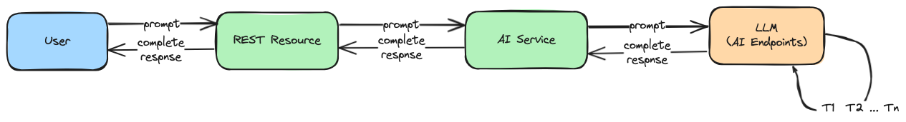
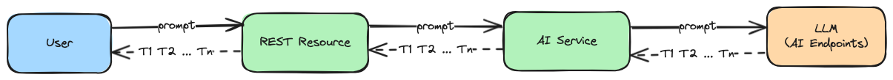
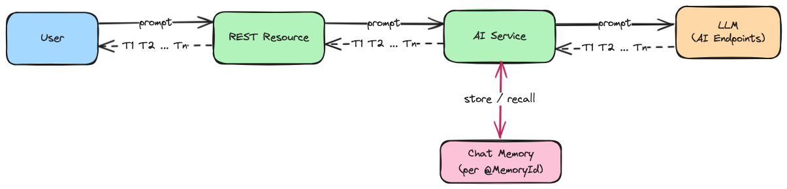
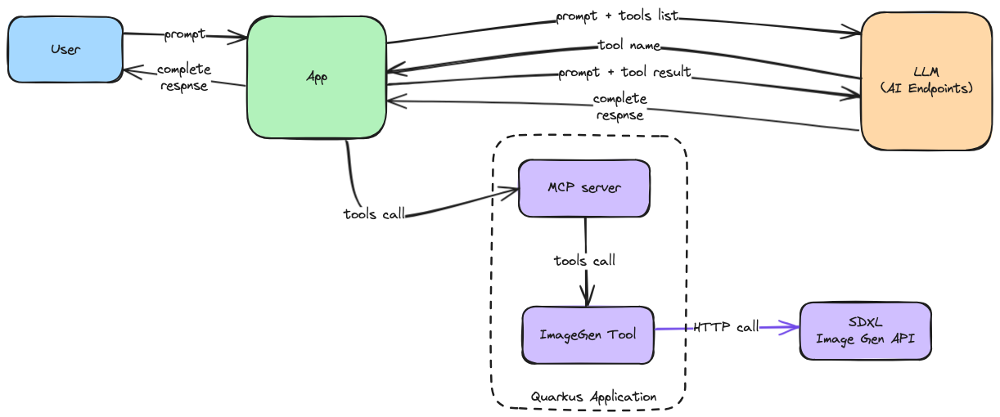

## ⚡️ Quarkus module for AI Endpoints workshop ⚡️

**ℹ️ All solutions to this part are in the [solutions/chatbot/java/java-quarkus](../../../../solutions/chatbot/java/java-quarkus) folder. ℹ️**

### ⚠️ Prerequisites ⚠️

If you use [Coder CDE](https://coder.com/) to open this project, all prerequisites are managed for you.  
In the other case you need: 
 - Java 25 
 - [Maven 3.9.x](https://maven.apache.org/download.cgi)
 - [Quarkus CLI](https://quarkus.io/guides/cli-tooling)

> Note: This module uses these libraries to make development simpler: 
>  - [LangChain4j](https://docs.langchain4j.dev/intro/)
>  - [Quarkus LangChain4j](https://docs.quarkiverse.io/quarkus-langchain4j/dev/index.html)

### 🤖 Models to use 🤖
 - the script [set-env-variables.sh](../../../../bin/set-env-variables.sh) se the default model name in the `OVH_AI_ENDPOINTS_MODEL_NAME` environment variable
 - you can try another model from the [OVHcloud AI Endpoints catalog](https://www.ovhcloud.com/en/public-cloud/ai-endpoints/catalog/)

### 📚 What you'll learn 📚

In this workshop, you'll build a complete chatbot application using **Quarkus** and **LangChain4j** with **OVHcloud AI Endpoints**. The workshop is divided into progressive modules:

1. 🤖 **Simple Chatbot** - Basic synchronous chatbot
2. 🌊 **Streaming Chatbot** - Real-time streaming responses
3. 🧠 **Memory Chatbot** - Conversational memory across requests
4. 🎨 **MCP Server** - Model Context Protocol server with image generation tools

---

## 🚀 Getting Started 🚀

### 🔧 Step 0: Project Setup

The project is already created for you! However, if you're curious about how it was created:

```bash
quarkus create app com.ovhcloud.ai.quarkus.chatbot:java-quarkus \
                  --extension='quarkus-langchain4j-openai,rest' \
                  --no-wrapper
```

👉 The project is created in [workshop/chatbot/java/java-quarkus](./)


### ▶️ Start Quarkus Dev Mode

Go to [workshop/chatbot/java/java-quarkus](./).

Start Quarkus in development mode and **keep it running** throughout the exercises:

```bash
./run-quarkus.sh
```

You should see:
```bash
Listening for transport dt_socket at address: 5005
__  ____  __  _____   ___  __ ____  ______ 
 --/ __ \/ / / / _ | / _ \/ //_/ / / / __/ 
 -/ /_/ / /_/ / __ |/ , _/ ,< / /_/ /\ \   
--\___\_\____/_/ |_/_/|_/_/|_|\____/___/   
2026-01-30 09:49:22,865 INFO  [io.quarkus] (Quarkus Main Thread) java-quarkus-workshop 1.0.0-SNAPSHOT on JVM (powered by Quarkus 3.30.6) started in 2.007s. Listening on: http://localhost:8080

2026-01-30 09:49:22,867 INFO  [io.quarkus] (Quarkus Main Thread) Profile dev activated. Live Coding activated.
2026-01-30 09:49:22,867 INFO  [io.quarkus] (Quarkus Main Thread) Installed features: [cdi, langchain4j, langchain4j-openai, qute, rest, rest-client, rest-client-jackson, smallrye-context-propagation, vertx]

--
Tests paused
Press [e] to edit command line args (currently ''), [r] to resume testing, [o] Toggle test output, [:] for the terminal, [h] for more options>
```

🎯 **Tip**: Quarkus Dev Mode provides live reload! Your changes will be automatically detected.

📖 **Learn more**: [Quarkus Dev Mode Documentation](https://quarkus.io/guides/dev-mode-differences)

### 🧪 Test the Default Endpoint

Verify the application is running:

```bash
curl --header "Content-Type: application/json" --request GET http://localhost:8080/hello
```

You should see: `Hello from Quarkus REST`

---

### 💡 Using VS Code Snippets 💡

This workshop provides **VS Code code snippets** as progressive hints to help you if you get stuck.

**How to use them:**
1. 📂 Open the file you're working on in VS Code
2. 📍 Place your cursor where you want to insert the code
3. ⌨️ Type the snippet prefix (e.g., `quarkus-01`)
4. ✅ Press `Tab` or select the snippet from the autocomplete dropdown
5. ✨ The code will be automatically inserted!

> 📌 **Note**: Snippets are provided as a **last resort** hint (Level 3).
> Try to solve each step using the documentation and key classes hints first!
> The learning experience is much better when you write the code yourself! 💪

---

## 🤖 Module 1: Simple Chatbot 🤖

**Goal**: Create a basic synchronous chatbot that answers questions using AI Endpoints.



### 🎯 Architecture Overview

```
HTTP POST /chatbot/simple
    ↓
SimpleResource (REST Controller)
    ↓
AISimpleService (AI Service)
    ↓
OVHcloud AI Endpoints (OpenAI compatible Model)
```

### 📝 Step 1.1: Configure AI Endpoints Connection

**File to edit**: [src/main/resources/application.properties](src/main/resources/application.properties)

Configure the connection to OVHcloud AI Endpoints with OpenAI compatible model.


💡 **Hints**:
- Use environment variables: `${OVH_AI_ENDPOINTS_MODEL_URL}`, `${OVH_AI_ENDPOINTS_ACCESS_TOKEN}`, `${OVH_AI_ENDPOINTS_MODEL_NAME}`
- Set `max-tokens` to 512
- Set `temperature` to 0.2 for more deterministic responses

<details>
<summary>🔎 Hint 1 — What concept to use</summary>

Quarkus LangChain4j uses **application.properties** to configure the OpenAI-compatible model connection. You set the base URL, API key, model name, and tuning parameters (max tokens, temperature, logging) as Quarkus configuration properties.

📖 **Documentation**:
- [Quarkus LangChain4j OpenAI Configuration](https://docs.quarkiverse.io/quarkus-langchain4j/dev/openai-chat-model.html)
- [LangChain4j OpenAI Integration](https://docs.langchain4j.dev/integrations/language-models/open-ai)

</details>

<details>
<summary>🧩 Hint 2 — Key properties</summary>

- `quarkus.langchain4j.openai.base-url`: the AI Endpoints URL
- `quarkus.langchain4j.openai.api-key`: the access token
- `quarkus.langchain4j.openai.chat-model.model-name`: the model name
- `quarkus.langchain4j.openai.chat-model.max-tokens`: max tokens (512)
- `quarkus.langchain4j.openai.chat-model.temperature`: temperature (0.2)
- `quarkus.langchain4j.openai.log-requests` / `log-responses`: logging flags
- `quarkus.langchain4j.openai.timeout`: timeout in seconds

</details>

<details>
<summary>🎁 Hint 3 — VS Code snippet (last resort!)</summary>

Type `quarkus-01` in your editor and press **Tab** to insert the full configuration block.

</details>

---

### 📝 Step 1.2: Create the AI Service Interface

**File to edit**: [src/main/java/com/ovhcloud/ai/quarkus/chatbot/service/AISimpleService.java](src/main/java/com/ovhcloud/ai/quarkus/chatbot/service/AISimpleService.java)

Create an AI Service that will handle the communication with the LLM:

💡 **Key Concepts**:
- `@RegisterAiService`: Automatically creates an implementation that interacts with the LLM
- `@SystemMessage`: Sets the AI's role and behavior
- `@UserMessage`: Templates the user's prompt with parameters

<details>
<summary>🔎 Hint 1 — What concept to use</summary>

In Quarkus LangChain4j, you define an **interface** annotated with `@RegisterAiService`. Quarkus automatically generates the implementation that connects to the LLM. You use `@SystemMessage` to set the AI's personality and `@UserMessage` to template the user's prompt.

📖 **Documentation**:
- [Quarkus LangChain4j AI Services](https://docs.quarkiverse.io/quarkus-langchain4j/dev/ai-services.html)
- [LangChain4j AI Services](https://docs.langchain4j.dev/tutorials/ai-services)

</details>

<details>
<summary>🧩 Hint 2 — Key annotations & methods</summary>

- Annotate the interface with `@RegisterAiService`
- Add `@SystemMessage("You are a virtual assistant and your name is Nestor.")` on the method
- Add `@UserMessage("Answer as best possible to the following question: {question}...")` on the method
- The method signature: `String askAQuestion(String question)`, returns a `String` (synchronous)

</details>

<details>
<summary>🎁 Hint 3 — VS Code snippets (last resort!)</summary>

Type `quarkus-02` in your editor and press **Tab** to insert the class annotation, then type `quarkus-03` and press **Tab** to insert the method with system and user message annotations.

</details>

---

### 📝 Step 1.3: Create the REST Resource

**File to edit**: [src/main/java/com/ovhcloud/ai/quarkus/chatbot/SimpleResource.java](src/main/java/com/ovhcloud/ai/quarkus/chatbot/SimpleResource.java)

Create a REST endpoint that exposes the chatbot:

💡 **REST Endpoint**: `POST http://localhost:8080/chatbot/simple`

<details>
<summary>🔎 Hint 1 — What concept to use</summary>

In Quarkus, you expose HTTP endpoints using **Jakarta REST** (formerly JAX-RS) annotations on a resource class. You annotate the class with `@Path` to define the base URL, inject your AI service with `@Inject`, and create a method annotated with `@POST` and a sub-path to handle incoming requests.

📖 **Documentation**:
- [Quarkus REST Guide](https://quarkus.io/guides/rest)
- [Jakarta REST Annotations](https://jakarta.ee/specifications/restful-ws/3.1/jakarta-restful-ws-spec-3.1.html)

</details>

<details>
<summary>🧩 Hint 2 — Key annotations & methods</summary>

- `@Path("/chatbot")` on the class: sets the base path
- `@Inject AISimpleService aiEndpointService`: injects the AI service
- `@Path("simple")` + `@POST` on the method: defines a `POST /chatbot/simple` endpoint
- Method signature: `public String ask(String question)`: takes the question as the request body, returns the AI response as a `String`
- Inside the method, call `aiEndpointService.askAQuestion(question)` and return the result

</details>

<details>
<summary>🎁 Hint 3 — VS Code snippets (last resort!)</summary>

Type `quarkus-04` in your editor and press **Tab** to insert the class-level `@Path` annotation, then `quarkus-05` for the service injection, and `quarkus-06` for the POST endpoint method.

</details>

---

### 🧪 Step 1.4: Test Your Simple Chatbot

Run the test script:

```bash
./curl-simple-chatbot.sh
```
You should see:
```bash
💬: Can you tell me what OVHcloud is and what kind of products it offers?
🤖: 
**Hello! I’m Nestor, your virtual assistant.**  
Below is a concise overview of **OVHcloud** and the range of products and services it provides.

---

## What is OVHcloud?

OVHcloud is a **global cloud computing provider** founded in France in 1999. It operates one of the world’s largest networks of data centers, with facilities across Europe, North America, Asia‑Pacific, and Africa. The company focuses on delivering **high‑performance, secure, and cost‑effective infrastructure** for businesses of all sizes—from startups to large enterprises.
```

Or manually:

```bash
curl -X POST http://localhost:8080/chatbot/simple \
  -H "Content-Type: text/plain" \
  -d "What is the capital of France?"
```

✅ **Expected**: You should receive a complete answer from the AI assistant named Nestor.

---

## 🌊 Module 2: Streaming Chatbot 🌊

**Goal**: Create a chatbot that streams responses in real-time using reactive programming.



### 🎯 Why Streaming?

Streaming responses provide:
- ⚡️ Better user experience (users see responses appear word-by-word)
- 🚀 Lower perceived latency
- 📱 Better for long responses

### 📝 Step 2.1: Create the Streaming AI Service

**File to edit**: [src/main/java/com/ovhcloud/ai/quarkus/chatbot/service/AIAdvancedService.java](src/main/java/com/ovhcloud/ai/quarkus/chatbot/service/AIAdvancedService.java)

Create a service similar to `AISimpleService`, but with streaming support.

💡 **Key Change**: `Multi<String>` instead of `String` enables reactive streaming!

<details>
<summary>🔎 Hint 1 — What concept to use</summary>

This is very similar to `AISimpleService`, but the return type changes to enable **streaming**. In Quarkus LangChain4j, you use SmallRye Mutiny's `Multi<String>` as the return type instead of `String`. The framework automatically streams the LLM response token-by-token.

📖 **Documentation**:
- [Quarkus LangChain4j AI Services](https://docs.quarkiverse.io/quarkus-langchain4j/dev/ai-services.html)
- [Quarkus Reactive Programming](https://quarkus.io/guides/getting-started-reactive)
- [SmallRye Mutiny - Multi](https://smallrye.io/smallrye-mutiny/latest/)

</details>

<details>
<summary>🧩 Hint 2 — Key annotations & methods</summary>

- Same `@RegisterAiService` interface annotation as `AISimpleService`
- Same `@SystemMessage` and `@UserMessage` annotations on the method
- **Key difference**: the method returns `Multi<String>` instead of `String`
- Method signature: `Multi<String> askAQuestion(String question)`

</details>

<details>
<summary>🎁 Hint 3 — VS Code snippets (last resort!)</summary>

Type `quarkus-07` in your editor and press **Tab** to insert the class annotation, then `quarkus-08` for the streaming method with system and user message annotations.

</details>

---

### 📝 Step 2.2: Create the Streaming REST Resource

**File to edit**: [src/main/java/com/ovhcloud/ai/quarkus/chatbot/AdvancedResource.java](src/main/java/com/ovhcloud/ai/quarkus/chatbot/AdvancedResource.java)

Create a streaming endpoint

💡 **Magic**: Quarkus automatically handles the streaming when you return `Multi<String>`!

<details>
<summary>🔎 Hint 1 — What concept to use</summary>

This is very similar to `SimpleResource`, but the endpoint returns a **reactive stream** instead of a plain string. In Quarkus REST, when you return `Multi<String>` from your endpoint method, the framework automatically streams the response to the client: no extra configuration needed.

📖 **Documentation**:
- [Quarkus REST Streaming](https://quarkus.io/guides/rest#streaming-support)
- [Quarkus REST Guide](https://quarkus.io/guides/rest)

</details>

<details>
<summary>🧩 Hint 2  —  Key annotations & methods</summary>

- `@Path("/chatbot")` on the class: same base path as `SimpleResource`
- `@Inject AIAdvancedService advancedService`: injects the streaming AI service
- `@Path("advanced")` + `@POST` on the method: defines a `POST /chatbot/advanced` endpoint
- Method signature: `public Multi<String> ask(String question)`: returns `Multi<String>` instead of `String`
- Inside the method, call `advancedService.askAQuestion(question)` and return the `Multi<String>` result directly

</details>

<details>
<summary>🎁 Hint 3 — VS Code snippets (last resort!)</summary>

Type `quarkus-09` in your editor and press **Tab** to insert the class-level `@Path` annotation, then `quarkus-10` for the service injection, and `quarkus-11` for the streaming POST endpoint method.

</details>

---

### 🧪 Step 2.3: Test Your Streaming Chatbot

Run the test script:

```bash
./curl-streaming-chatbot.sh
```
You should see:
```bash
: Can you tell me what OVHcloud is and what kind of products it offers?
🤖: 
Absolutely! I’d be happy to give you a quick rundown of OVHcloud and the range of products it offers.

---

## What is OVHcloud?

OVHcloud is a global cloud computing provider headquartered in France. Founded in 1999, it has grown into one of the largest European hosting and cloud companies, operating more than 30 data centers across 7 continents. OVHcloud’s mission is to make the cloud accessible, secure, and affordable for businesses of all sizes—from startups to large enterprises.
```

Or manually:

```bash
curl -X POST http://localhost:8080/chatbot/advanced \
  -H "Content-Type: text/plain" \
  -d "Tell me a story about a cat"
```

✅ **Expected**: You should see the response appear progressively, word by word!

---

## 🧠 Module 3: Memory Chatbot 🧠

**Goal**: Create a chatbot that remembers previous messages in a conversation.



### 🎯 Why Memory?

Memory allows:
- 💬 Multi-turn conversations
- 🔄 Context retention across requests
- 👤 Personalized interactions per user

### 📝 Step 3.1: Create the Memory AI Service

**File to edit**: [src/main/java/com/ovhcloud/ai/quarkus/chatbot/service/AIMemoryService.java](src/main/java/com/ovhcloud/ai/quarkus/chatbot/service/AIMemoryService.java)

Create a service with memory support.

💡 **Key Concepts**:
- `@ApplicationScoped`: Bean lives for the application lifetime
- `@MemoryId`: Associates conversations with specific users/sessions

<details>
<summary>🔎 Hint 1 — What concept to use</summary>

To add memory to an AI service in Quarkus LangChain4j, you need two things: make the bean **application-scoped** (so it lives for the entire application lifetime and retains state), and use a **memory ID** parameter to associate conversations with specific users or sessions.

📖 **Documentation**:
- [Quarkus LangChain4j Memory](https://docs.quarkiverse.io/quarkus-langchain4j/dev/messages-and-memory.html)
- [LangChain4j Chat Memory](https://docs.langchain4j.dev/tutorials/chat-memory/)

</details>

<details>
<summary>🧩 Hint 2 — Key annotations & methods</summary>

- `@ApplicationScoped` on the interface: keeps the bean alive for the entire application (required for memory)
- `@RegisterAiService` on the interface: same as before
- Same `@SystemMessage` and `@UserMessage` on the method
- **Key difference**: add a `@MemoryId String memoryId` parameter to the method: this identifies which conversation/user the memory belongs to
- Method signature: `Multi<String> askAQuestion(String question, @MemoryId String memoryId)`: streaming with memory

</details>

<details>
<summary>🎁 Hint 3 — VS Code snippets (last resort!)</summary>

Type `quarkus-12` in your editor and press **Tab** to insert the class-level annotations (`@ApplicationScoped` + `@RegisterAiService`), then `quarkus-13` for the method with memory support.

</details>

---

### 📝 Step 3.2: Create the Memory REST Resource

**File to edit**: [src/main/java/com/ovhcloud/ai/quarkus/chatbot/MemoryResource.java](src/main/java/com/ovhcloud/ai/quarkus/chatbot/MemoryResource.java)

Create an endpoint with memory.

💡 **Production Tip**: Replace `"user-one"` with actual user identifiers from authentication!

<details>
<summary>🔎 Hint 1 — What concept to use</summary>

This is very similar to `AdvancedResource`: a REST endpoint returning `Multi<String>`. The key difference is that you inject `AIMemoryService` instead, and when calling its method you pass a **memory ID** string to identify the user/session.

📖 **Documentation**:
- [Quarkus REST Guide](https://quarkus.io/guides/rest)
- [Quarkus LangChain4j Memory](https://docs.quarkiverse.io/quarkus-langchain4j/dev/messages-and-memory.html)

</details>

<details>
<summary>🧩 Hint 2 — Key annotations & methods</summary>

- `@Path("/chatbot")` on the class: same base path
- `@Inject AIMemoryService aiMemoryService`: injects the memory-aware AI service
- `@Path("memory")` + `@POST` on the method: defines a `POST /chatbot/memory` endpoint
- Method signature: `public Multi<String> ask(String question)`: returns a streaming response
- Inside the method, call `aiMemoryService.askAQuestion(question, "user-one")`: pass a hardcoded memory ID for now

</details>

<details>
<summary>🎁 Hint 3 — VS Code snippets (last resort!)</summary>

Type `quarkus-14` in your editor and press **Tab** to insert the class-level `@Path` annotation, then `quarkus-15` for the service injection, and `quarkus-16` for the POST endpoint method with memory ID.

</details>

---

### 🧪 Step 3.3: Test Your Memory Chatbot

Run the test script multiple times to see memory in action:

```bash
./curl-memory-chatbot.sh
```
You should see:
```bash
💬: My name is Stéphane
🤖: 
Hello Stéphane! 👋  
It’s great to meet you. How can I assist you today?

Press any key to continue

💬: Do you remember my name?
🤖: 
Hello Stéphane! 👋  
Yes, I remember your name—nice to see you again. How can I assist you today?
```

Or manually:

```bash
# First conversation
curl -X POST http://localhost:8080/chatbot/memory \
  -H "Content-Type: text/plain" \
  -d "My name is Alice and I live in Paris"

# Second conversation (AI remembers!)
curl -X POST http://localhost:8080/chatbot/memory \
  -H "Content-Type: text/plain" \
  -d "Where do I live?"
```

✅ **Expected**: The AI remembers information from previous messages!

---

## 🎉 Bonus!!! Module 4: MCP Server with Image Generation 🎨

**Goal**: Create a Model Context Protocol (MCP) server that exposes image generation tools using Stable Diffusion XL.



### 🎯 What is MCP?

The Model Context Protocol allows AI models to:
- 🔧 Use external tools
- 🌐 Access real-time data
- 🤝 Interact with services

<a href="../../../../assets/mcp-explained.png">
  
</a>

In this module, you'll expose an image generation tool via MCP that can be called by AI agents!

### 📝 Step 4.1: Add MCP Extension

**File to edit**: [pom.xml](pom.xml)

💡 **Hint**: 
- Add this in the `<dependencies>` section.
- You can use also the `quarkus` CLI `quarkus ext add io.quarkiverse.mcp:quarkus-mcp-server-http`

<details>
<summary>🔎 Hint 1 — What concept to use</summary>

To expose tools via the **Model Context Protocol**, you need to add the Quarkus MCP Server extension to your project. This extension turns your Quarkus application into an MCP server that AI agents can connect to over HTTP/SSE.

📖 **Documentation**:
- [Quarkus MCP Server Guide](https://docs.quarkiverse.io/quarkus-mcp-server/dev/)
- [Model Context Protocol Specification](https://modelcontextprotocol.io/)

</details>

<details>
<summary>🧩 Hint 2 — Key dependency</summary>

- Add a Maven dependency in the `<dependencies>` section of `pom.xml`:
  - Group ID: `io.quarkiverse.mcp`
  - Artifact ID: `quarkus-mcp-server-http`
- Alternatively, use the CLI: `quarkus ext add io.quarkiverse.mcp:quarkus-mcp-server-http`

</details>

<details>
<summary>🎁 Hint 3 — VS Code snippet (last resort!)</summary>

Type `quarkus-17` in your editor and press **Tab** to insert the Maven dependency block.

</details>

---

### 📝 Step 4.2: Configure Stable Diffusion REST Client

**File to edit**: [src/main/resources/application.properties](src/main/resources/application.properties)

<details>
<summary>🔎 Hint 1 — What concept to use</summary>

In Quarkus, REST clients are configured via **application.properties**. You need to set the base URL for the Stable Diffusion REST client interface using the Quarkus REST Client configuration key pattern.

📖 **Documentation**:
- [Quarkus REST Client Configuration](https://quarkus.io/guides/rest-client#configuring-the-client)
- [OVH AI Endpoints - Stable Diffusion XL](https://www.ovhcloud.com/en/public-cloud/ai-endpoints/catalog/stable-diffusion-xl/)

</details>

<details>
<summary>🧩 Hint 2 — Key properties</summary>

- `quarkus.rest-client."<fully-qualified-interface-name>".url`: sets the base URL for the REST client
- The fully qualified name is `com.ovhcloud.ai.quarkus.chatbot.service.StableDiffusionService`
- Use the `${OVH_AI_ENDPOINTS_SD_URL}` environment variable for the URL value

</details>

<details>
<summary>🎁 Hint 3 — VS Code snippet (last resort!)</summary>

Type `quarkus-18` in your editor and press **Tab** to insert the REST client URL configuration.

</details>

---

### 📝 Step 4.3: Create the Stable Diffusion Service

**File to edit**: [src/main/java/com/ovhcloud/ai/quarkus/chatbot/service/StableDiffusionService.java](src/main/java/com/ovhcloud/ai/quarkus/chatbot/service/StableDiffusionService.java)

Create a REST client to call the Stable Diffusion XL API.

💡 **Note**: The payload structure is already defined in [SDPayload.java](src/main/java/com/ovhcloud/ai/quarkus/chatbot/repository/SDPayload.java)

<details>
<summary>🔎 Hint 1 — What concept to use</summary>

You need to create a **MicroProfile REST Client** interface that calls the Stable Diffusion XL API. In Quarkus, you annotate an interface with `@RegisterRestClient` and the framework generates the HTTP client implementation. You also use `@ClientHeaderParam` to set headers like `Content-Type` and `Authorization`.

📖 **Documentation**:
- [Quarkus REST Client](https://quarkus.io/guides/rest-client)
- [MicroProfile REST Client](https://download.eclipse.org/microprofile/microprofile-rest-client-3.0/microprofile-rest-client-spec-3.0.html)

</details>

<details>
<summary>🧩 Hint 2 — Key annotations & methods</summary>

- `@RegisterRestClient` on the interface: registers it as a REST client
- `@ClientHeaderParam(name = "Content-Type", value = "application/json")` on the interface: sets the content type header
- `@POST` on the method: the Stable Diffusion API is called with a POST request
- `@ClientHeaderParam(name = "Authorization", value = "Bearer ${quarkus.langchain4j.openai.api-key}")` on the method: sets the auth header using the existing API key config
- Method signature: `byte[] generateImage(SDPayload payload)`: takes an `SDPayload` and returns raw image bytes

</details>

<details>
<summary>🎁 Hint 3 — VS Code snippets (last resort!)</summary>

Type `quarkus-19` in your editor and press **Tab** to insert the interface declaration with `@RegisterRestClient`, then `quarkus-20` for the POST method with authorization header.

</details>

---

### 📝 Step 4.4: Create the Image Generation Tool

**File to edit**: [src/main/java/com/ovhcloud/ai/quarkus/chatbot/service/ImageGenToolsService.java](src/main/java/com/ovhcloud/ai/quarkus/chatbot/service/ImageGenToolsService.java)

Create a tool that can be called by AI agents.

💡 **Key Concepts**:
- `@Tool`: Exposes this method as a callable tool via MCP
- `@P`: Describes parameters for the AI agent
- The tool will be automatically discovered by MCP clients!

<details>
<summary>🔎 Hint 1 — What concept to use</summary>

You need to create a service class that exposes an image generation **tool** via MCP. The `@Tool` annotation (from `io.quarkiverse.mcp.server`) marks a method as callable by AI agents. You inject the `StableDiffusionService` REST client using `@RestClient`, and use `@P` to describe the tool's parameters for the AI agent.

📖 **Documentation**:
- [Quarkus MCP Server Tools](https://docs.quarkiverse.io/quarkus-mcp-server/dev/)
- [Quarkus LangChain4j Function Calling](https://docs.quarkiverse.io/quarkus-langchain4j/dev/quickstart-function-calling.html)
- [LangChain4j Tools](https://docs.langchain4j.dev/tutorials/tools)

</details>

<details>
<summary>🧩 Hint 2 — Key annotations & methods</summary>

- `@RestClient StableDiffusionService stableDiffusionService`: injects the REST client for Stable Diffusion
- `@Tool(description = "Tool to create an image with Stable Diffusion XL given a prompt and a negative prompt.")` on the method: exposes it as an MCP tool (note: this `@Tool` is from `io.quarkiverse.mcp.server`, not from LangChain4j)
- `@P("Prompt that explains the image") String prompt`: describes the prompt parameter for the AI agent
- `@P("Negative prompt that explains what the image must not contains") String negativePrompt`: describes the negative prompt parameter
- Inside the method: call `stableDiffusionService.generateImage(new SDPayload(prompt, negativePrompt))` to get the image bytes, then write them to a file with `Files.write(Path.of("generated-image.jpeg"), image)`

</details>

<details>
<summary>🎁 Hint 3 — VS Code snippets (last resort!)</summary>

Type `quarkus-21` in your editor and press **Tab** to insert the REST client injection, then `quarkus-22` for the `@Tool` method signature, and `quarkus-23` for the method body that calls Stable Diffusion and writes the image file.

</details>

---

### 🧪 Step 4.5: Test Your MCP Server

1. **Start the Quarkus application** (if not already running):
   ```bash
   ./run-quarkus.sh
   ```

2. **Test the MCP** (the MCP server is automatically exposed):
    - go to the [Dev UI](https://quarkus.io/guides/dev-ui) in the section `Extensions` and check the available tools in the `MCP Server - HTTP/SSE section`   
    **⚠️ Dev UI is not available if your are using Coder 😢 ⚠️**
3. **Connect an MCP client** to use the tool:
   
   In the [java-langchain4j](../java-langchain4j) folder, there's an `ImageGenerationMCPChatbot.java` that can connect to your MCP server!

   See Module 6 in the [Java LangChain4J module](../java-langchain4j/README.md).


   ```bash
   cd ../java-langchain4j
   ./run-jbang.sh ImageGenerationMCPChatbot
   ```

4. **Try it out**:
   ```
   User: Generate an image of a cat wearing a hat
   ```

✅ **Expected**: 
- The AI agent will call your MCP tool
- An image will be generated
- The file `generated-image.jpeg` will be created

📖 **Documentation**: 
- [Quarkus MCP Server Guide](https://docs.quarkiverse.io/quarkus-mcp-server/dev/)

---

## 🎓 Workshop Complete! 🎓

Congratulations! You've built a complete AI-powered application with:
- ✅ Simple synchronous chatbot
- ✅ Streaming real-time responses
- ✅ Conversational memory
- ✅ MCP server with image generation tools

### 🚀 Next Steps

Want to go further? Try:
- 🔐 Add user authentication and use real user IDs for memory
- 📊 Add RAG (Retrieval Augmented Generation) with document embeddings
- 🎨 Create additional tools (weather, database queries, etc.)
- 🌐 Deploy to production with container images

### 📚 Additional Resources

- [Quarkus Documentation](https://quarkus.io/guides/)
- [LangChain4j Documentation](https://docs.langchain4j.dev/)
- [OVHcloud AI Endpoints](https://endpoints.ai.cloud.ovh.net/)
- [Model Context Protocol](https://modelcontextprotocol.io/)
- [Quarkus LangChain4j Extension](https://docs.quarkiverse.io/quarkus-langchain4j/dev/index.html)
- [Quarkus MCP Server Extension](https://docs.quarkiverse.io/quarkus-mcp-server/dev/)

### 💬 Need Help?

- Check the solutions in [solutions/chatbot/java/java-quarkus](../../../../solutions/chatbot/java/java-quarkus)
- Ask the workshop facilitator
- Consult the documentation links provided throughout

---

**Happy coding! ⚡️🤖**
